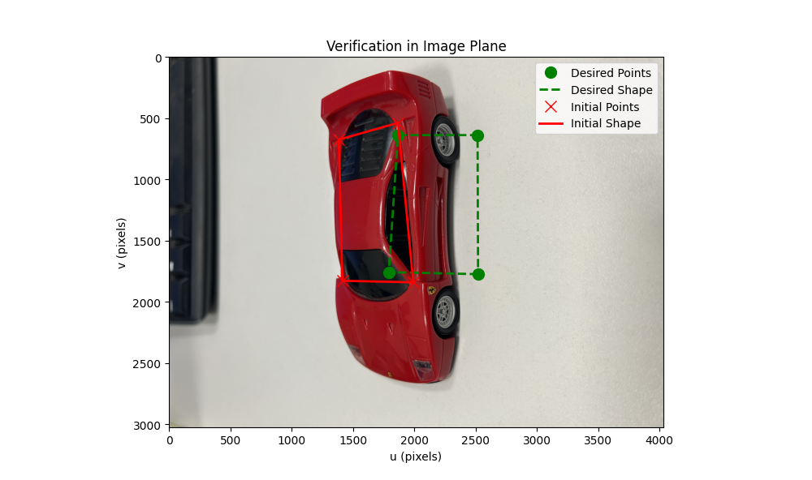
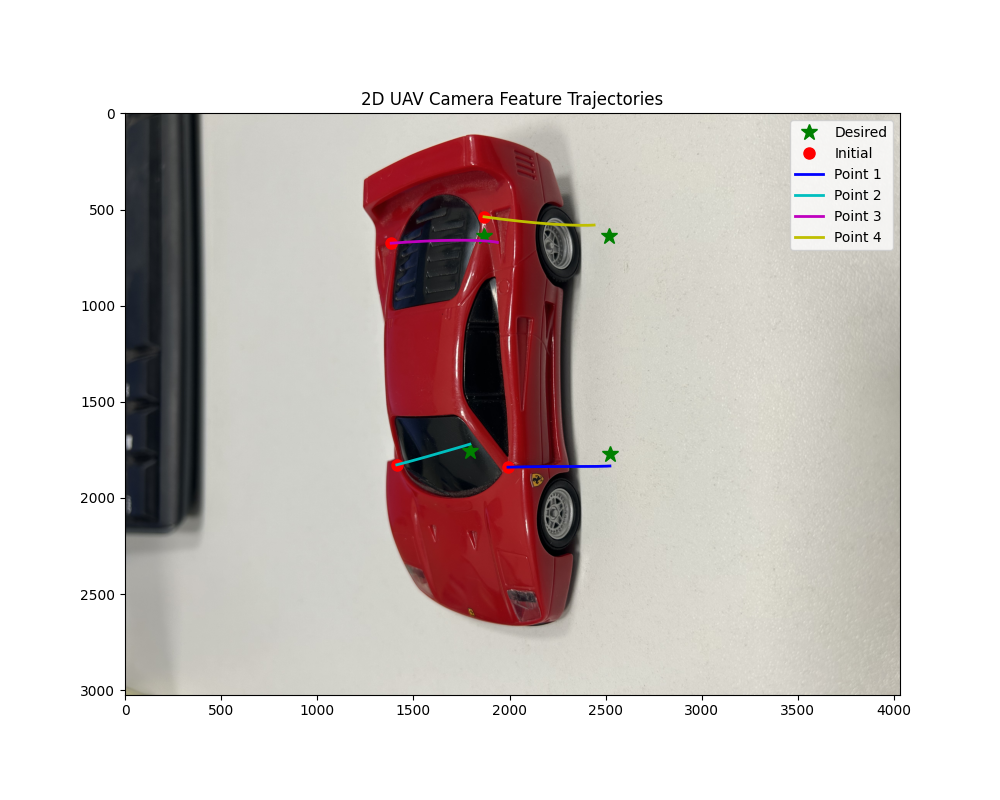
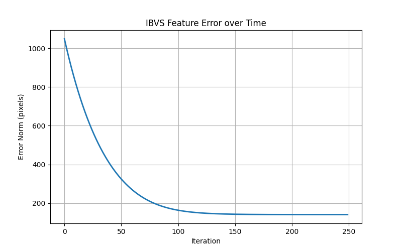
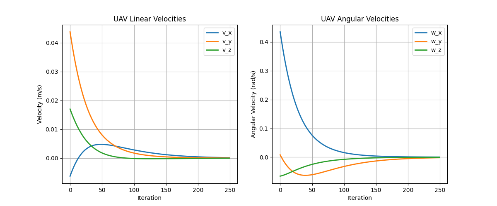

# 🚁 UAV Perception-to-Action: Image-Based Visual Servoing (IBVS)

This repository contains a Python implementation of an **Image-Based Visual Servoing (IBVS)** control system designed for autonomous drones (UAVs). The algorithm enables a drone to autonomously align itself over a target (e.g., a ground vehicle) using purely visual feedback from a downward-facing camera.

### 🛠️ Tech Stack & Mathematical Concepts
* **Language & Libraries:** Python, NumPy, Matplotlib (for spatial visualization)
* **Computer Vision:** Feature extraction, Image plane normalization.
* **Control Theory:** Interaction Matrix (Image Jacobian), Moore-Penrose Pseudoinverse, Exponential error decay, Control loop implementation.

### ⚙️ How It Works
The control system operates without knowing the 3D model of the target. Instead, it relies on 2D feature points extracted from the image plane:
1. **Feature Matching:** The algorithm compares the current feature coordinates (from the initial position) against the desired feature coordinates (from the target position).
2. **Interaction Matrix:** A dynamic Interaction Matrix ($L$) is calculated based on the camera's intrinsic parameters (focal length, pixel size) and an estimated depth.
3. **Control Law:** The velocity control law utilizes the pseudoinverse of the Interaction Matrix to compute the necessary linear ($v_x, v_y, v_z$) and angular ($\omega_x, \omega_y, \omega_z$) velocities for the drone's flight controller.

### 📊 Simulation & Results

**1. Visual Verification & Feature Selection**
The system first verifies the user-selected features. The initial state is marked in red, while the desired alignment target is marked in green.

**2. 2D Feature Trajectories**
The control loop calculates the optimal path. The feature points transition smoothly from the initial coordinates to the desired ones without leaving the camera's Field of View (FOV).

**3. Feature Error Convergence**
The feature error norm exhibits an exponential decay, demonstrating the asymptotic stability of the control loop without getting trapped in local minima.

**4. UAV Camera Velocities**
Initial velocities correct the alignment aggressively and smoothly decay to zero as the UAV reaches the target, preventing overshoot or dangerous oscillations.

### 🚀 How to Run
1. Ensure you have `numpy` and `matplotlib` installed. 
2. Run the `ibvs_simulation.py` script.
3. Click on 4 corresponding feature points in the provided target and initial images (Clockwise order: Top-Left, Top-Right, Bottom-Right, Bottom-Left).
